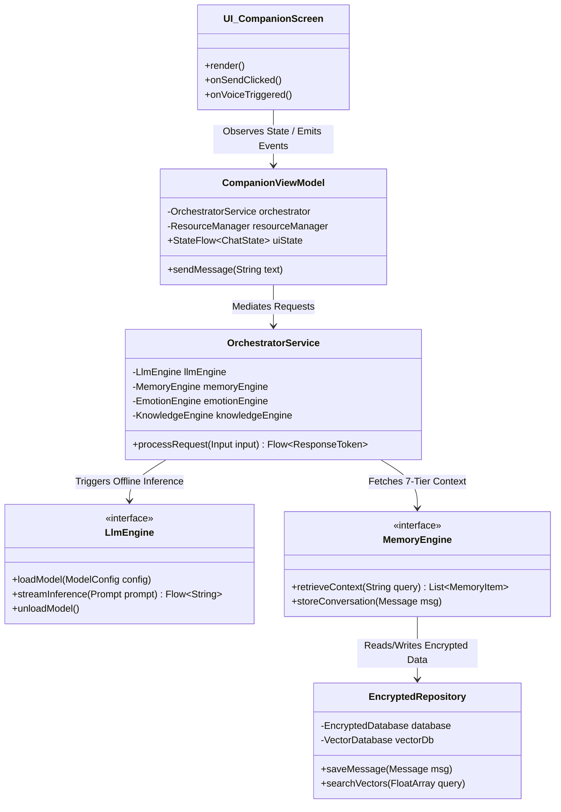
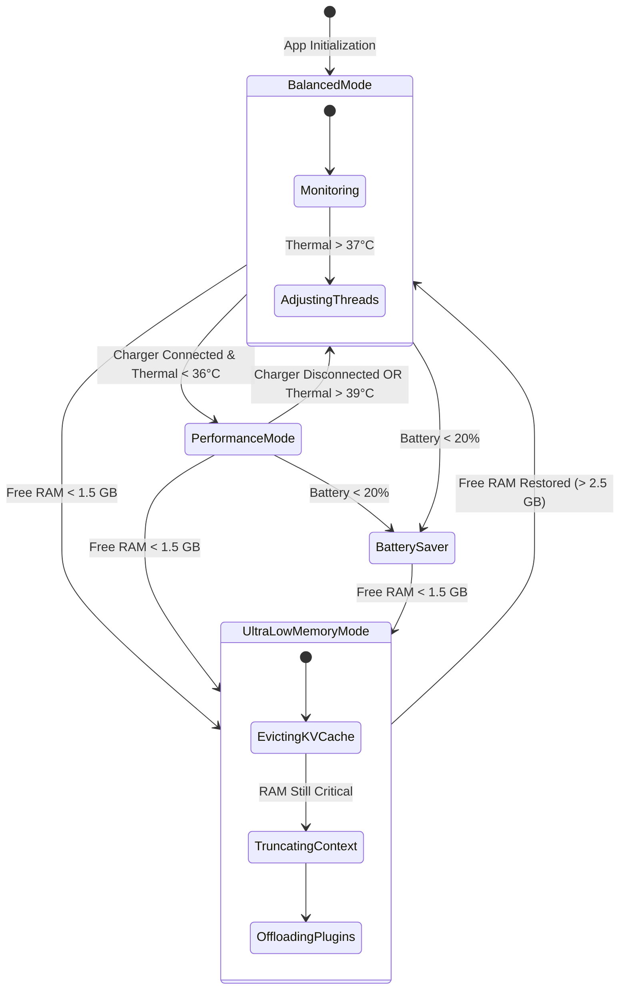
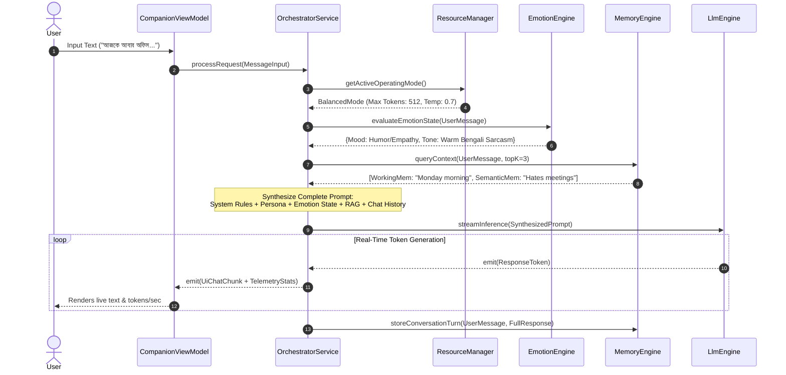

# Local AI Operating Platform & Companion ("Nodi" / নদী) — System Architecture

## 1. Architectural Overview & MVVM + Repository + Service Pattern

The platform is designed around strict separation of concerns, ensuring high modularity, testability, and zero cloud dependency. Every module operates autonomously and can be hot-swapped without altering core domain interfaces.



---

## 2. Complete Package Hierarchy & Folder Structure

```text
com.localai.nodi/
├── NodiApplication.kt              # Hilt Application container & crash handler
├── core/                           # Shared kernel
│   ├── di/                         # Hilt dependency injection modules
│   ├── dispatcher/                 # Coroutine dispatchers (InferencePool, IoPool)
│   ├── util/                       # Extensions, Result wrappers, Crypto utils
│   └── constants/                  # Resource thresholds & linguistic constants
├── orchestrator/                   # Central AI Orchestrator
│   ├── OrchestratorService.kt      # Main coordinator mediating UI and engines
│   ├── PromptSynthesizer.kt        # Formats system prompts with emotion & RAG
│   └── RequestRouter.kt            # Decides if memory/RAG/voice is needed
├── resource/                       # Hardware & Resource Management
│   ├── ResourceManager.kt          # Active RAM, thermal, and CPU monitor
│   ├── CpuAffinityManager.kt       # Pins threads to ARM64 Big/Little cores
│   └── model/                      # ResourceState, OperatingMode enums
├── engine/                         # Autonomous replaceable subsystems
│   ├── llm/                        # Language Model Engine
│   │   ├── LlmEngine.kt            # Interface definition
│   │   ├── LlamaCppEngineImpl.kt   # JNI/NDK llama.cpp binding implementation
│   │   ├── Tokenizer.kt            # Offline BPE/SentencePiece tokenizer
│   │   └── CacheManager.kt         # KV Cache & Prompt Cache controller
│   ├── memory/                     # 7-Tier Memory Engine
│   │   ├── MemoryEngine.kt         # Memory tier manager
│   │   ├── MemoryCompressor.kt     # Summarizes old logs into semantic summaries
│   │   └── MemoryRanker.kt         # Scores memories by relevance & emotional weight
│   ├── emotion/                    # Emotion & Tone Engine
│   │   ├── EmotionEngine.kt        # Tracks Mood, Energy, Stress, Time/Day
│   │   └── ToneInjector.kt         # Adapts Bengali/English persona rules
│   ├── voice/                      # Voice & Speech Recognition
│   │   ├── VoiceEngine.kt          # Offline STT & Wake Word (VAD)
│   │   └── TtsEngine.kt            # Natural Bengali/English TTS synthesizer
│   └── knowledge/                  # Knowledge Base & Vector RAG
│       ├── KnowledgeEngine.kt      # Local PDF/MD/TXT document ingestor
│       ├── ChunkingService.kt      # Recursive character text splitter
│       └── VectorSearcher.kt       # Cosine similarity vector similarity search
├── data/                           # Data persistence & encryption
│   ├── repository/                 # Repository layer implementing interfaces
│   ├── storage/                    # Encrypted local storage
│   │   ├── db/                     # Room + SQLCipher SQLite database
│   │   ├── vector/                 # Local encrypted vector database
│   │   └── vault/                  # Encrypted File Vault for GGUF/ONNX models
│   └── security/                   # Security Center & Verification
│       ├── IntegrityChecker.kt     # APK & database integrity validation
│       └── ModelVerifier.kt        # SHA256 checksum verification
└── ui/                             # Jetpack Compose Presentation Layer
    ├── theme/                      # Typography, Colors, Glassmorphism tokens
    ├── components/                 # Reusable telemetry badges, chat bubbles
    ├── companion/                  # AI Companion Chat Screen & ViewModel
    ├── dashboard/                  # Live Resource Dashboard Screen & ViewModel
    ├── models/                     # Model Manager Screen & ViewModel
    ├── memory/                     # Memory Inspector Screen & ViewModel
    ├── knowledge/                  # Knowledge Base Screen & ViewModel
    ├── developer/                  # Developer Console & Prompt Inspector
    └── settings/                   # Security & Privacy Settings
```

---

## 3. UI Mockups & Compose Component Layouts

### A. AI Companion Chat Screen (`CompanionScreen.kt`)
Designed with glassmorphic cards, smooth gradient accents, and real-time inference speed indicators.

```text
+-----------------------------------------------------------------------+
|  [☰]  🤖 Nodi (নদী) — Offline AI Companion    [⚡ Balanced | 38°C] |
+-----------------------------------------------------------------------+
|                                                                       |
|  +-----------------------------------------------------------------+  |
|  | Nodi: শুভ সন্ধ্যা! আজকের দিনটা কেমন কাটল আপনার?                    |  |
|  | [🧠 Working Memory Accessed] [🎭 Tone: Warm & Sarcastic]       |  |
|  +-----------------------------------------------------------------+  |
|                                                                       |
|                          +-----------------------------------------+  |
|                          | User: আজকে অফিসে অনেক মিটিং ছিল। ক্লান্ত।   |  |
|                          +-----------------------------------------+  |
|                                                                       |
|  +-----------------------------------------------------------------+  |
|  | Nodi: জীবনের তিনটা নিশ্চিত জিনিস— মৃত্যু, ট্যাক্স, আর সোমবারের মিটিং! 😄 |  |
|  | একটু চা খেয়ে বিশ্রাম নিন। আমি কি কোনো শান্ত গান বা গল্প শোনাব?          |  |
|  |                                                                 |  |
|  | ⚡ 24.5 tokens/sec | 🧠 RAM: 4.2/8.0 GB | ⏱️ Load: 120ms          |  |
|  +-----------------------------------------------------------------+  |
|                                                                       |
+-----------------------------------------------------------------------+
|  [ 📎 Attach PDF ] [ 🎙️ Voice ] [ লিখুন...                         ] [ ➤ ] |
+-----------------------------------------------------------------------+
```

### B. Live Diagnostics Dashboard (`DashboardScreen.kt`)
Provides real-time graphs and telemetry required by `instruction.txt`.

```text
+-----------------------------------------------------------------------+
|  📊 System Diagnostics & Resource Manager               [ 🛡️ Secure ] |
+-----------------------------------------------------------------------+
|  Operating Mode: [ Dynamic Performance Mode ]   Battery: 84% (4h left)|
+-----------------------------------------------------------------------+
|  CPU Core Utilization (ARM64 Big/Little Cores)                        |
|  Core 0-3 (Little): [████░░░░░░] 40%  | Core 4-7 (Big): [████████░░] 80%|
|  Thermal Status: 36.5°C (Normal)      | CPU Freq: 2.4 GHz             |
+-----------------------------------------------------------------------+
|  Memory & Storage Allocation                                          |
|  RAM Usage: 4.8 GB / 8.0 GB           | Model Cache (mmap): 2.1 GB    |
|  Encrypted SQLite: 14.2 MB            | Vector Store: 45.0 MB         |
+-----------------------------------------------------------------------+
|  LLM Inference Telemetry (Llama-3-8B-Instruct.Q4_K_M.gguf)            |
|  Prompt Eval Speed: 110.4 t/s         | Generation Speed: 26.8 t/s    |
|  Context Size: 1024 / 4096 tokens     | Thread Affinity: 4 Big Cores  |
+-----------------------------------------------------------------------+
```

---

## 4. State Diagram: Dynamic Resource Modes



---

## 5. Sequence Diagram: Orchestrated Inference Flow


