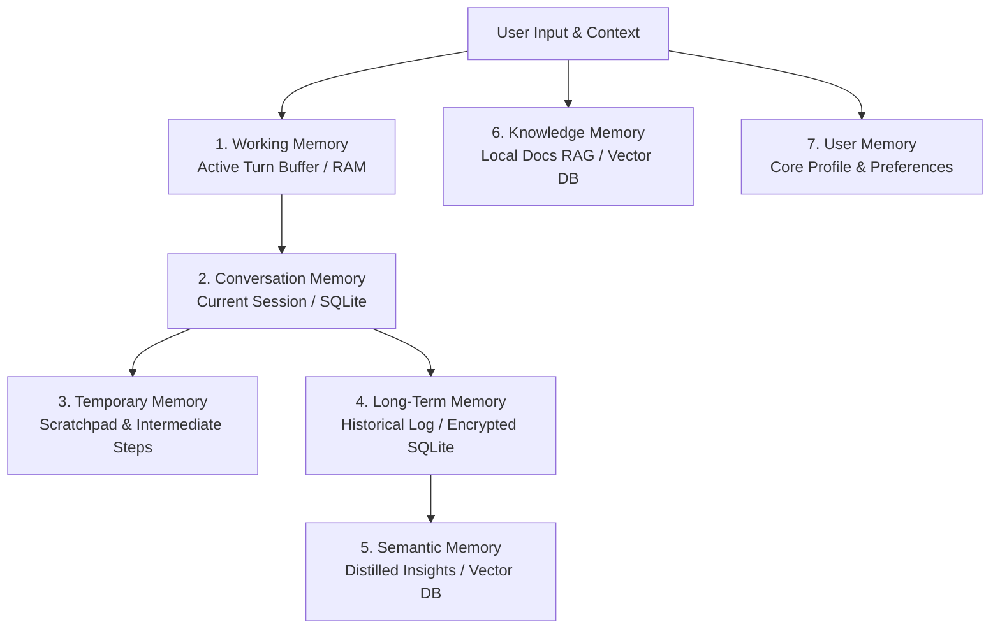
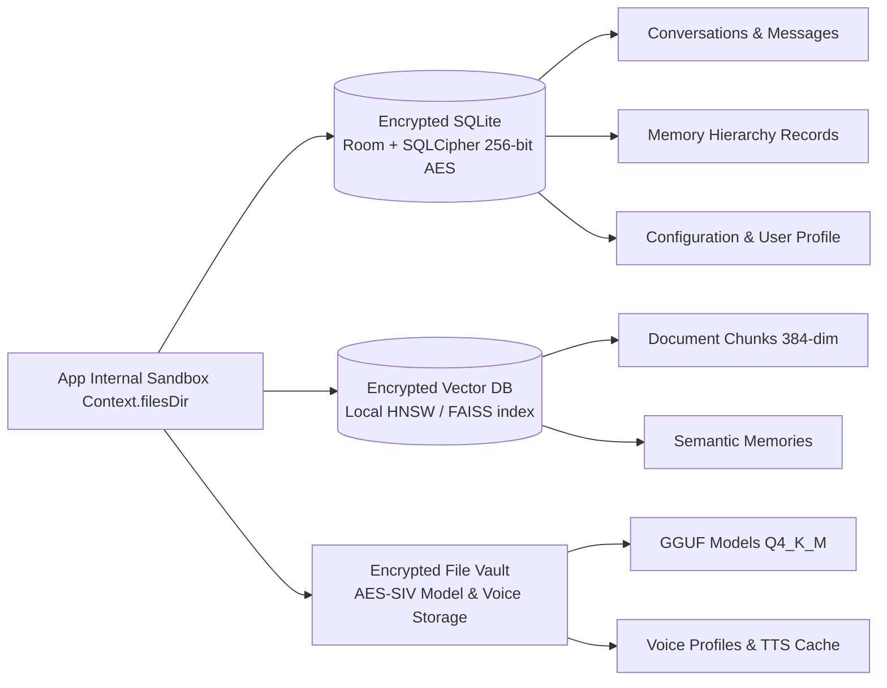

# Local AI Android Platform ("Nodi") — Memory & Storage Specification

## 1. 7-Tier Memory Hierarchy Architecture

To operate effectively as an offline thinking partner without exceeding resource limits, Nodi utilizes a **7-Tier Memory Hierarchy**. Each tier has distinct eviction policies, persistence mechanisms, and latency profiles.

### Memory Tier Breakdown Table

| Tier | Persistence | Max Capacity | Eviction Policy | Description |
| :--- | :--- | :--- | :--- | :--- |
| **1. Working Memory** | RAM (`ConcurrentHashMap`) | ~512 Tokens | FIFO / Turn Boundary | Holds raw tokens of active user/assistant turns. Evicted to Conversation Memory after completion. |
| **2. Conversation Memory** | Encrypted SQLite (`conversations`, `messages`) | Last 50 Turns | Sliding Window | Retains immediate dialogue flow. Older turns are compressed into Long-Term/Semantic memory. |
| **3. Temporary Memory** | RAM / Cache Dir | 10 MB limit | TTL (30 mins) | Intermediate calculation results, code snippets, or draft voice transcriptions. |
| **4. Long-Term Memory** | Encrypted SQLite (`memory_entries`) | 10,000 Records| Least Importance Score | Raw historical chat logs stored securely at rest. |
| **5. Semantic Memory** | Encrypted Vector Store | 5,000 Embeddings | Cosine Similarity Threshold | Distilled concepts, user sentiments, and philosophical reflections. |
| **6. Knowledge Memory** | Encrypted Vector Store | 50,000 Chunks | Manual Deletion | Chunked local PDFs, Markdown, TXT, and JSON files ingested by the user. |
| **7. User Memory** | Encrypted SQLite (`user_profile`) | 500 Key-Values | User Controlled | Explicit facts about the user (e.g., name, profession, language preference, personality quirks). |

---

## 2. Memory Lifecycle Operations

### A. Memory Ranking (`MemoryRanker.kt`)
Every conversation turn is evaluated by a lightweight heuristic ranking algorithm before storage:
$$\text{Score} = w_1 \cdot \text{Recency} + w_2 \cdot \text{EmotionalWeight} + w_3 \cdot \text{AccessFrequency}$$
* **High Score ($\ge 0.8$)**: Promoted to **User Memory** or **Semantic Memory**.
* **Medium Score ($0.4 - 0.7$)**: Retained in **Long-Term Memory**.
* **Low Score ($< 0.4$)**: Flagged for auto-cleanup after 14 days.

### B. Memory Compression (`MemoryCompressor.kt`)
When **Conversation Memory** exceeds 30 turns, background worker threads (running on ARM64 Little Cores during idle periods) trigger a summarization pass using a lightweight 1B quantized model to condense 30 turns into a 3-sentence summary stored in `conversations.summary`.

### C. Backup, Restore, Export & Import
* **Encryption**: All backups are exported as `.nodi_backup` archives encrypted via **AES-GCM-256** derived from a user-provided passphrase (PBKDF2).
* **Import/Export Format**: Standardized JSON schema ensuring portability across offline installations while stripping temporary device tokens.

---

## 3. Storage Architecture & Encryption Specifications

All persistent data resides inside Android's internal app sandbox (`Context.filesDir`), heavily fortified against root exploits and forensic extraction.

### Detailed Storage Compartments

1. **Encrypted SQLite (`EncryptedDatabase.kt`)**:
   * Uses **SQLCipher** (256-bit AES). Key is generated via Android Keystore (`KeyGenParameterSpec`) backed by hardware Trusted Execution Environment (TEE) / StrongBox.
   * Stores: Chat logs, memory items, app configuration, and usage telemetry logs.
2. **Encrypted Vector Database (`VectorDatabase.kt`)**:
   * Stores 384-dimensional embedding vectors generated locally via lightweight `all-MiniLM-L6-v2` or quantized embedding models.
   * Uses memory-mapped HNSW (Hierarchical Navigable Small World) indexing encrypted at rest.
3. **Encrypted File Vault (`FileVault.kt`)**:
   * Stores multi-gigabyte `.gguf` and `.onnx` models, custom TTS voice profiles, attachments, and logs.
   * Verifies **SHA-256 Checksums** before mounting files into memory mapping (`mmap`) to prevent tampering or corrupted model execution.
